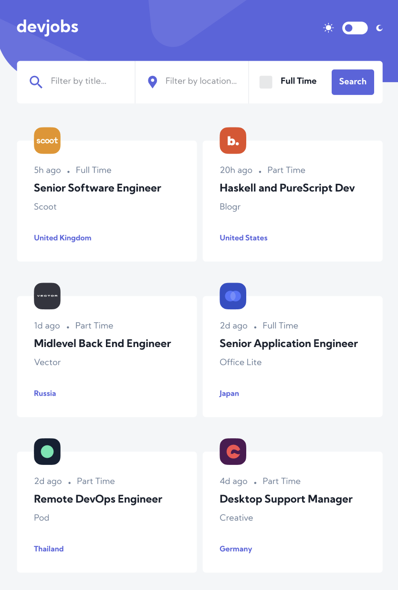
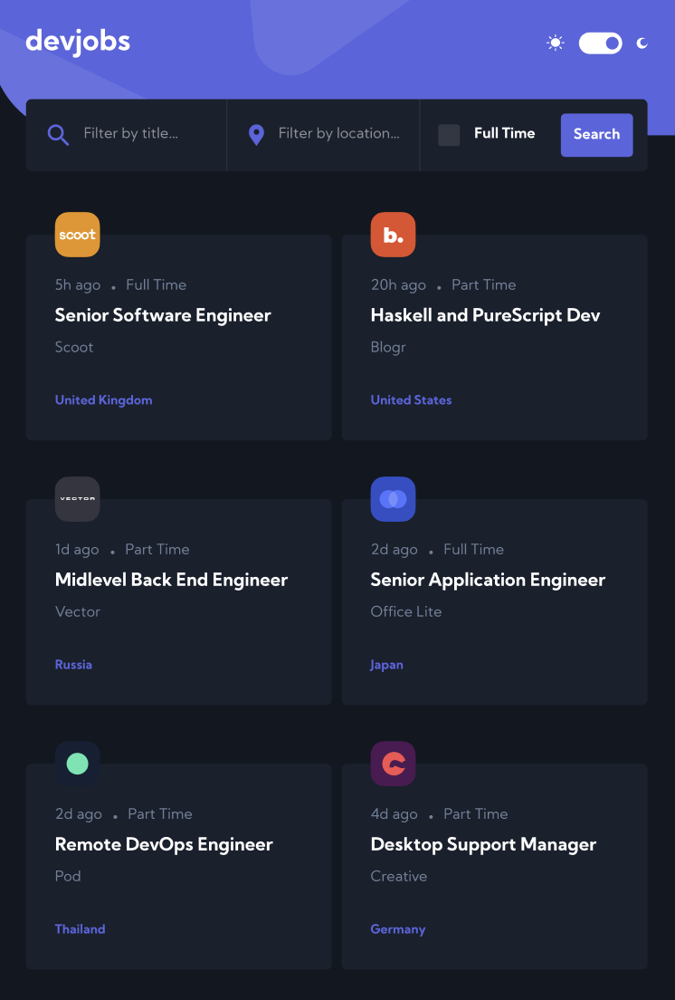
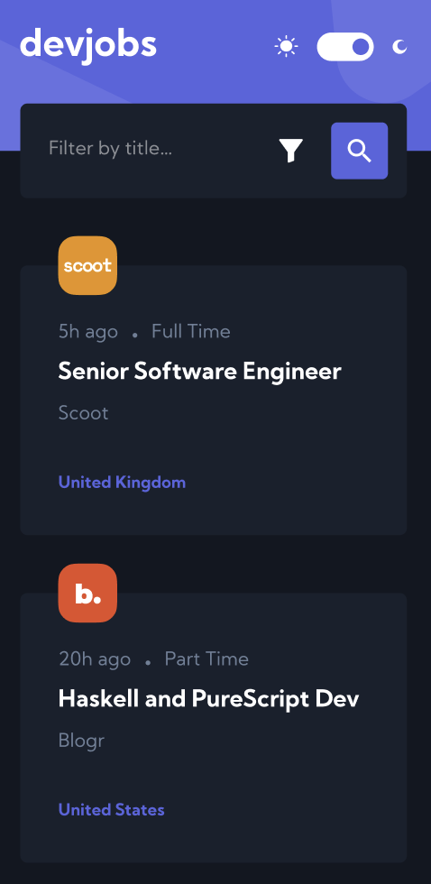

# DevJobs - Developer Job Search Platform

A modern, responsive job search platform designed specifically for developers and tech professionals. Built with vanilla JavaScript and Vite for optimal performance and user experience.

## 🚀 Features

### Core Functionality

- **Real-time Job Search**: Instant search results as you type
- **Advanced Filtering**: Filter jobs by title, location, and employment type
- **Dynamic Job Listings**: Jobs fetched from API and updated in real-time
- **Responsive Design**: Perfect experience across all devices

### User Interface

- **Dark/Light Mode Toggle**: Switch between themes for comfortable viewing
- **Clean Modern Design**: Intuitive and professional interface
- **Interactive Elements**: Smooth animations and hover effects
- **Mobile-First Approach**: Optimized for mobile devices

### Search & Filter Options

- 🔍 **Job Title Search**: Find specific roles and positions
- 📍 **Location Filter**: Search by geographic location
- ⏰ **Employment Type**: Filter between Full Time and Part Time positions
- 🎯 **Smart Suggestions**: Real-time search suggestions

## 🛠️ Technologies Used

- **Frontend Framework**: Vanilla JavaScript (ES6+)
- **Build Tool**: Vite
- **Styling**: CSS3 with modern features
- **Markup**: HTML5 semantic elements
- **API Integration**: RESTful API consumption
- **Responsive Design**: CSS Grid & Flexbox

## 📱 Screenshots

### Light Mode



### Dark Mode



### Mobile View



## 🎯 Getting Started

### Prerequisites

- Node.js (v14 or higher)
- npm or yarn package manager

### Installation

1. **Clone the repository**

   ```bash
   git clone https://github.com/khamzaevasad/devjobs.git
   cd devjobs
   ```

2. **Install dependencies**

   ```bash
   npm install
   ```

3. **Start development server**

   ```bash
   npm run dev
   ```

4. **Build for production**

   ```bash
   npm run build
   ```

5. **Preview production build**
   ```bash
   npm run preview
   ```

## 📁 Project Structure

```
devjobs/
├── public/
│   ├── favicon.ico
│   └── screenshots/
├── src/
│   ├── assets/
│   │   ├── css/
│   │   │   └── style.css
│   │   └── images/
│   ├── js/
│   │   ├── api.js
│   │   ├── components.js
│   │   ├── theme.js
│   │   └── main.js
│   └── index.html
├── package.json
├── vite.config.js
└── README.md
```

## 🔧 Configuration

### API Configuration

Update the API endpoint in `src/js/api.js`:

```javascript
const API_BASE_URL = "---";
```

### Theme Customization

Modify theme variables in `src/assets/css/style.css`:

```css
:root {
  --primary-color: #5964e0;
  --secondary-color: #19202d;
  --bg-color: #f4f6f8;
  --text-color: #19202d;
}

[data-theme="dark"] {
  --bg-color: #121721;
  --text-color: #ffffff;
}
```

## 🎨 Features in Detail

### Real-time Search

- Debounced search input for optimal performance
- Instant results without page refresh
- Search across job titles and company names

### Advanced Filtering

- **Location Filter**: Auto-complete location suggestions
- **Employment Type**: Toggle between Full Time and Part Time
- **Combined Filters**: Multiple filters work together seamlessly

### Theme System

- **Automatic Detection**: Respects user's system preference
- **Manual Toggle**: Easy switch between light and dark modes
- **Persistent Storage**: Theme preference saved locally

### Responsive Design

- **Mobile-First**: Designed for mobile devices first
- **Tablet Optimized**: Perfect layout for tablets
- **Desktop Enhanced**: Rich experience on larger screens

## 🚀 Performance Optimizations

- **Vite Build System**: Lightning-fast development and builds
- **Code Splitting**: Optimized bundle sizes
- **Image Optimization**: Compressed and responsive images
- **CSS Optimization**: Minified and purged CSS
- **API Caching**: Cached API responses for better performance

## 🌐 Browser Support

- Chrome (latest)
- Firefox (latest)
- Safari (latest)
- Edge (latest)
- Mobile browsers (iOS Safari, Chrome Mobile)

## 📈 Future Enhancements

- [ ] Job bookmarking functionality
- [ ] Advanced search filters (salary range, experience level)
- [ ] User authentication and profiles
- [ ] Job application tracking
- [ ] Email notifications for new jobs
- [ ] Company profiles and reviews

## 🤝 Contributing

1. Fork the repository
2. Create your feature branch (`git checkout -b feature/AmazingFeature`)
3. Commit your changes (`git commit -m 'Add some AmazingFeature'`)
4. Push to the branch (`git push origin feature/AmazingFeature`)
5. Open a Pull Request

## 📄 License

This project is licensed under the MIT License - see the [LICENSE](LICENSE) file for details.

## 👨‍💻 Author

**Your Name**

- GitHub: [@khamzaevasad](https://github.com/khamzaevasad)
- Email: xamzayevasad442@gmail.com

## 🙏 Acknowledgments

- Design inspiration from modern job platforms
- Icons provided by [Heroicons](https://heroicons.com/)
- API data structure based on industry standards
- Community feedback and contributions

---

⭐ **If you found this project helpful, please give it a star!** ⭐
